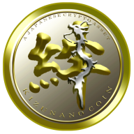

    

---

### What is KIZUNANO COIN?

KIZUNANO COIN is a digital payment protocol designed to be accessible and lightweight, with a focus on removing inefficiencies present in other cryptocurrencies. With ultrafast transactions and zero fees on a secure, green and decentralized network, this makes KIZUNANO COIN ideal for everyday transactions.

---

### Guides & Documentation

* [Whitepaper](https://kizunanocoin.com/en/whitepaper)
* [Running a Node](https://docs.kizunanocoin.com/running-a-node/overview/)
* [Integration Guides](https://docs.kizunanocoin.com/integration-guides/the-basics/)
* [Command Line Interface](https://docs.kizunanocoin.com/commands/command-line-interface/)
* [RPC Protocol](https://docs.kizunanocoin.com/commands/rpc-protocol/)

Other documentation details can be found at https://docs.kizunanocoin.com.

---

### Links & Resources

* [KIZUNANO COIN Website](https://www.newkizunacoin.com/)
* [Documentation](https://docs.kizunanocoin.com)
* [Discord Chat](https://chat.kizunanocoin.com/)
* [Twitter](https://twitter.com/newkizunacoin)

---

### Want to Contribute?

Please see the [contributors guide](https://docs.kizunanocoin.com/node-implementation/contributing/).

---

### Contact us

We want to hear about any trouble, success, delight, or pain you experience when
using KIZUNANO COIN. Let us know by [filing an issue](https://github.com/kizunanocoin/node/issues), or joining us on [Discord](https://chat.kizunanocoin.com/).
